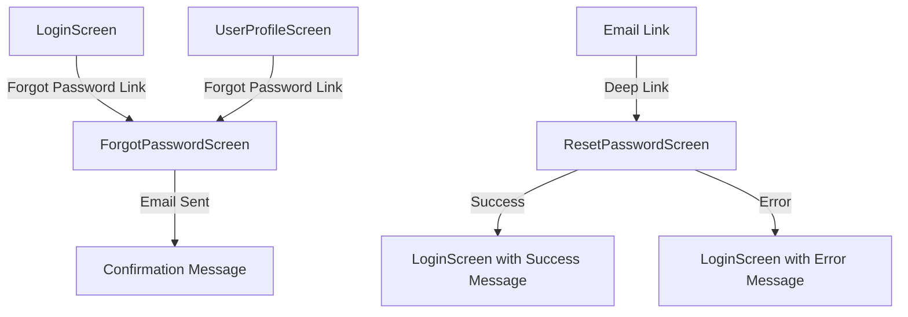

# Design Document

## Overview

The forgot password feature will integrate seamlessly with the existing React Native app architecture, leveraging Firebase Authentication's built-in password reset functionality. The design follows the app's current patterns for authentication, navigation, and UI components while adding three key touchpoints: forgot password links on the login and profile screens, and a dedicated password reset screen for handling email links.

## Architecture

### Component Architecture
The feature will integrate with the existing authentication flow:

```
App.tsx (Navigation)
├── LoginScreen.tsx (Add forgot password link)
├── UserProfileScreen.tsx (Add forgot password link in change password modal)
├── ForgotPasswordScreen.tsx (New - email input screen)
└── ResetPasswordScreen.tsx (New - password reset from email link)
```

### Service Layer Integration
The feature will extend the existing authentication services:

```
src/services/
├── authService.ts (Add password reset methods)
├── AuthStateManager.ts (Handle reset flow state)
└── firebase/services.ts (Firebase Auth integration)
```

### Navigation Flow


## Components and Interfaces

### New Screens

#### ForgotPasswordScreen
- **Purpose**: Collect user email and send password reset email
- **Location**: `src/screens/ForgotPasswordScreen.tsx`
- **Features**:
  - Email input with validation
  - Send reset email button
  - Loading states and error handling
  - Success confirmation message
  - Navigation back to login

#### ResetPasswordScreen  
- **Purpose**: Handle password reset from email links
- **Location**: `src/screens/ResetPasswordScreen.tsx`
- **Features**:
  - Token validation from URL parameters
  - New password input with confirmation
  - Password strength validation
  - Success/error handling
  - Automatic redirect to login

### Modified Components

#### LoginScreen Updates
- Add "Forgot Password?" link below password input
- Link navigates to ForgotPasswordScreen
- Maintain existing styling and theme support

#### UserProfileScreen Updates
- Add "Forgot Password?" link in change password modal
- Position below current password input
- Handle logout after successful password reset

### Service Extensions

#### AuthService Methods
```typescript
interface ForgotPasswordMethods {
  sendPasswordResetEmail(email: string): Promise<void>;
  confirmPasswordReset(code: string, newPassword: string): Promise<void>;
  verifyPasswordResetCode(code: string): Promise<string>; // Returns email
}
```

## Data Models

### Password Reset State
```typescript
interface PasswordResetState {
  isLoading: boolean;
  emailSent: boolean;
  error: string | null;
  email: string;
}

interface ResetPasswordState {
  isLoading: boolean;
  isValidToken: boolean;
  error: string | null;
  newPassword: string;
  confirmPassword: string;
  tokenCode: string;
}
```

### Navigation Parameters
```typescript
type RootStackParamList = {
  // ... existing routes
  ForgotPassword: undefined;
  ResetPassword: { code: string }; // From email link
};
```

## Error Handling

### Email Sending Errors
- Invalid email format: Real-time validation feedback
- Network errors: Retry option with user-friendly message
- Rate limiting: Clear message about waiting period
- Non-existent email: Generic success message for security

### Password Reset Errors
- Invalid/expired token: Clear error with option to request new email
- Weak password: Real-time validation with strength indicator
- Network errors: Retry option
- Password mismatch: Immediate validation feedback

### Security Considerations
- Generic success messages for email sending (don't reveal if email exists)
- Token expiration handling
- Rate limiting on reset requests
- Secure token validation

## Testing Strategy

### Unit Tests
- Email validation logic
- Password strength validation
- Error handling scenarios
- State management

### Integration Tests
- Firebase Auth integration
- Navigation flow between screens
- Deep link handling for email links
- Error recovery scenarios

### User Experience Tests
- Loading states and transitions
- Error message clarity
- Accessibility compliance
- Theme consistency (light/dark mode)

### Security Tests
- Token validation
- Rate limiting behavior
- Error message information disclosure
- Deep link security

## Implementation Considerations

### Firebase Configuration
- Ensure Firebase Auth is configured for password reset emails
- Customize email templates if needed
- Configure deep link handling for email links

### Deep Link Integration
- Extend existing deep link service to handle password reset URLs
- Parse reset token from URL parameters
- Handle invalid/malformed links gracefully

### State Management
- Integrate with existing AuthStateManager
- Handle loading states consistently with current patterns
- Maintain authentication state during reset process

### UI/UX Consistency
- Follow existing design patterns and components
- Maintain theme support (light/dark mode)
- Use consistent typography and spacing
- Implement proper loading indicators and error states

### Accessibility
- Proper ARIA labels and roles
- Screen reader support
- Keyboard navigation
- High contrast support

### Performance
- Lazy load new screens
- Optimize bundle size
- Efficient state updates
- Proper cleanup on unmount