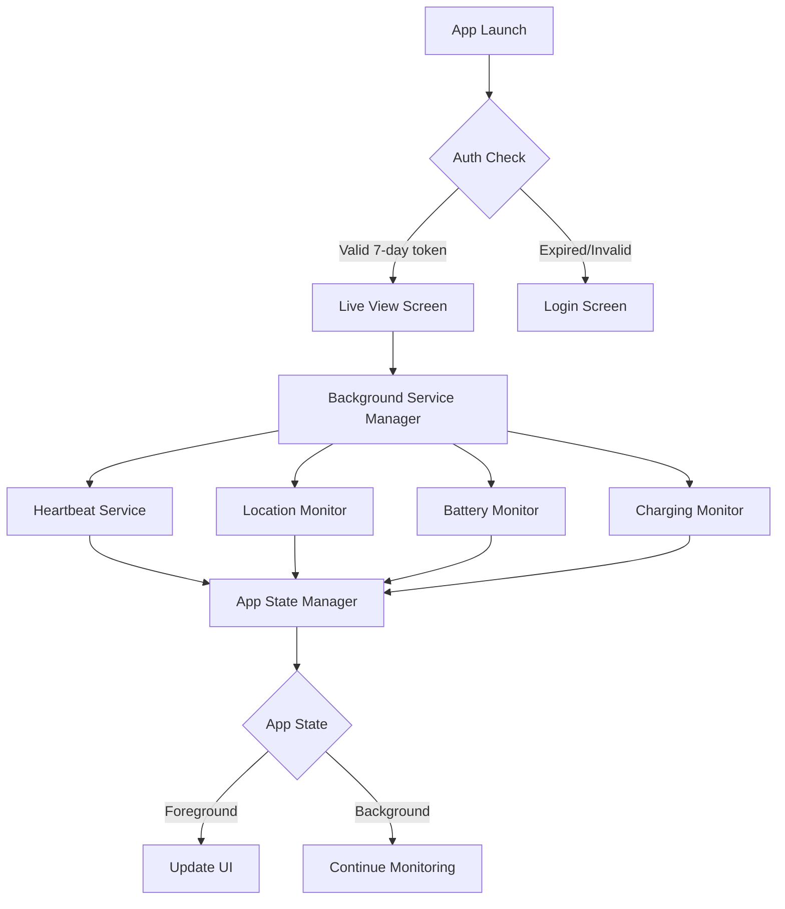
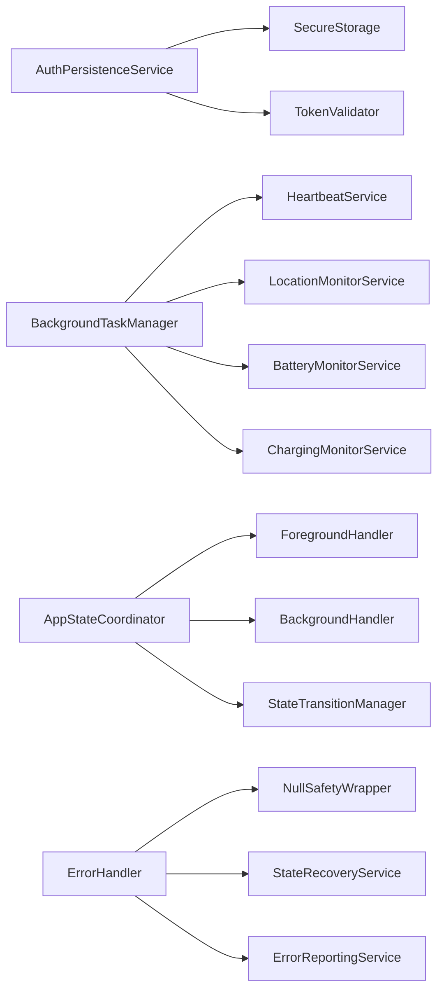

# Design Document

## Overview

This design implements a comprehensive 7-day authentication persistence system with robust background task management for the GeoGuardian app. The solution addresses authentication flow optimization, background service management, error handling improvements, and seamless app state transitions.

The design focuses on three core areas:
1. **Authentication Persistence**: Secure 7-day token storage and validation
2. **Background Task Management**: Continuous monitoring services for location, battery, and charging status
3. **Error Resilience**: Robust error handling and state management

## Architecture

### High-Level Architecture



### Component Architecture



## Components and Interfaces

### 1. Authentication Persistence Service

**Purpose**: Manages 7-day authentication token storage and validation

```typescript
interface AuthPersistenceService {
  // Token management
  storeAuthToken(user: FirebaseUser, expirationDays?: number): Promise<void>;
  validateStoredAuth(): Promise<AuthValidationResult>;
  clearStoredAuth(): Promise<void>;
  
  // Auto-login flow
  attemptAutoLogin(): Promise<AutoLoginResult>;
  isWithinValidPeriod(): Promise<boolean>;
  
  // Security
  refreshTokenIfNeeded(): Promise<TokenRefreshResult>;
  handleSecurityBreach(): Promise<void>;
}

interface AuthValidationResult {
  isValid: boolean;
  user: FirebaseUser | null;
  expiresAt: number;
  needsRefresh: boolean;
  error?: string;
}
```

**Key Features**:
- Secure token storage using React Native Keychain/SecureStore
- Automatic token refresh before expiration
- Graceful fallback on validation failures
- Security breach detection and response

### 2. Background Task Manager

**Purpose**: Coordinates all background monitoring services

```typescript
interface BackgroundTaskManager {
  // Lifecycle management
  initialize(): Promise<void>;
  startBackgroundTasks(): Promise<void>;
  stopBackgroundTasks(): Promise<void>;
  
  // Service coordination
  registerService(service: BackgroundService): void;
  unregisterService(serviceId: string): void;
  
  // State management
  handleAppStateChange(state: AppStateStatus): Promise<void>;
  optimizeForBattery(batteryLevel: number): void;
  
  // Monitoring
  getServiceStatus(): ServiceStatusReport;
  handleServiceError(serviceId: string, error: Error): Promise<void>;
}

interface BackgroundService {
  id: string;
  name: string;
  priority: 'high' | 'medium' | 'low';
  interval: number;
  
  start(): Promise<void>;
  stop(): Promise<void>;
  execute(): Promise<void>;
  handleError(error: Error): Promise<void>;
}
```

### 3. Individual Background Services

#### Heartbeat Service
```typescript
interface HeartbeatService extends BackgroundService {
  sendHeartbeat(): Promise<void>;
  updateLastSeen(): Promise<void>;
  checkConnectivity(): Promise<boolean>;
}
```

#### Location Monitor Service
```typescript
interface LocationMonitorService extends BackgroundService {
  getCurrentLocation(): Promise<LocationData>;
  checkRadiusViolation(center: Coordinate, radius: number): Promise<boolean>;
  handleLocationChange(location: LocationData): Promise<void>;
}
```

#### Battery Monitor Service
```typescript
interface BatteryMonitorService extends BackgroundService {
  getBatteryLevel(): Promise<number>;
  getBatteryState(): Promise<BatteryState>;
  handleLowBattery(): Promise<void>;
  optimizeForBatteryLevel(level: number): void;
}
```

#### Charging Monitor Service
```typescript
interface ChargingMonitorService extends BackgroundService {
  getChargingStatus(): Promise<ChargingStatus>;
  handleChargingStateChange(isCharging: boolean): Promise<void>;
  adjustTaskFrequency(isCharging: boolean): void;
}
```

### 4. App State Coordinator

**Purpose**: Manages transitions between foreground and background states

```typescript
interface AppStateCoordinator {
  // State management
  getCurrentState(): AppStateStatus;
  handleStateTransition(newState: AppStateStatus): Promise<void>;
  
  // Foreground/Background coordination
  onForeground(): Promise<void>;
  onBackground(): Promise<void>;
  
  // Data synchronization
  syncDataOnForeground(): Promise<void>;
  preserveStateOnBackground(): Promise<void>;
  
  // UI coordination
  updateUIWithCurrentData(): Promise<void>;
  navigateToLiveView(): void;
}
```

### 5. Error Handler and Null Safety

**Purpose**: Provides robust error handling and null safety wrappers

```typescript
interface ErrorHandler {
  // Null safety
  safeForEach<T>(array: T[] | null | undefined, callback: (item: T, index: number) => void): void;
  safeMap<T, R>(array: T[] | null | undefined, callback: (item: T, index: number) => R): R[];
  safeFilter<T>(array: T[] | null | undefined, predicate: (item: T) => boolean): T[];
  
  // Error recovery
  handleAuthStateError(error: Error): Promise<void>;
  handleBackgroundTaskError(serviceId: string, error: Error): Promise<void>;
  recoverFromCorruptedState(): Promise<void>;
  
  // Logging and reporting
  logError(error: Error, context: string, severity: ErrorSeverity): void;
  reportCriticalError(error: Error, context: string): Promise<void>;
}
```

## Data Models

### Authentication Token Model
```typescript
interface AuthToken {
  token: string;
  refreshToken?: string;
  userId: string;
  issuedAt: number;
  expiresAt: number;
  lastValidated: number;
  deviceId: string;
}
```

### Background Service Status Model
```typescript
interface ServiceStatus {
  id: string;
  name: string;
  isRunning: boolean;
  lastExecution: number;
  nextExecution: number;
  errorCount: number;
  lastError?: string;
  performance: {
    averageExecutionTime: number;
    successRate: number;
  };
}
```

### App State Model
```typescript
interface AppState {
  current: AppStateStatus;
  previous: AppStateStatus;
  transitionTime: number;
  backgroundDuration: number;
  foregroundTime: number;
  isAuthenticated: boolean;
  hasValidToken: boolean;
}
```

## Error Handling

### Null Safety Strategy

1. **Array Operation Wrappers**: All forEach, map, filter operations wrapped with null checks
2. **Defensive Programming**: Always check for null/undefined before array operations
3. **Graceful Degradation**: Provide fallback behavior when data is missing
4. **Error Boundaries**: Catch and handle errors at component boundaries

### Error Recovery Patterns

1. **Authentication Errors**: Clear corrupted tokens, redirect to login
2. **Background Task Errors**: Restart failed services, reduce frequency on repeated failures
3. **State Corruption**: Reset to known good state, preserve user data where possible
4. **Network Errors**: Queue operations for retry, maintain offline functionality

## Testing Strategy

### Unit Testing
- Authentication token validation logic
- Background service execution and error handling
- Null safety wrapper functions
- State transition logic

### Integration Testing
- End-to-end authentication flow
- Background service coordination
- App state transitions
- Error recovery scenarios

### Performance Testing
- Background task resource usage
- Battery impact measurement
- Memory leak detection
- UI responsiveness during state transitions

## Security Considerations

### Token Security
- Use React Native Keychain for secure token storage
- Implement token rotation before expiration
- Clear tokens on security breach detection
- Encrypt sensitive data at rest

### Background Task Security
- Validate all background operations
- Implement rate limiting for API calls
- Secure communication channels
- Monitor for suspicious activity patterns

## Performance Optimizations

### Battery Optimization
- Reduce background task frequency on low battery
- Increase task frequency when charging
- Use efficient location monitoring APIs
- Implement smart scheduling based on usage patterns

### Memory Management
- Clean up unused resources
- Implement proper service lifecycle management
- Use weak references where appropriate
- Monitor memory usage and implement cleanup triggers

### Network Optimization
- Batch network requests where possible
- Implement request queuing for offline scenarios
- Use compression for data transmission
- Cache frequently accessed data

## Implementation Phases

### Phase 1: Authentication Persistence
- Implement secure token storage
- Add 7-day validation logic
- Update login flow to bypass when valid
- Add token refresh mechanism

### Phase 2: Background Task Framework
- Create background task manager
- Implement service registration system
- Add app state coordination
- Create error handling framework

### Phase 3: Individual Services
- Implement heartbeat service
- Add location monitoring service
- Create battery monitoring service
- Implement charging status monitoring

### Phase 4: Error Handling and Optimization
- Add null safety wrappers throughout codebase
- Implement error recovery mechanisms
- Add performance monitoring
- Optimize for battery usage

### Phase 5: Testing and Refinement
- Comprehensive testing of all components
- Performance optimization
- Security audit
- User experience refinement